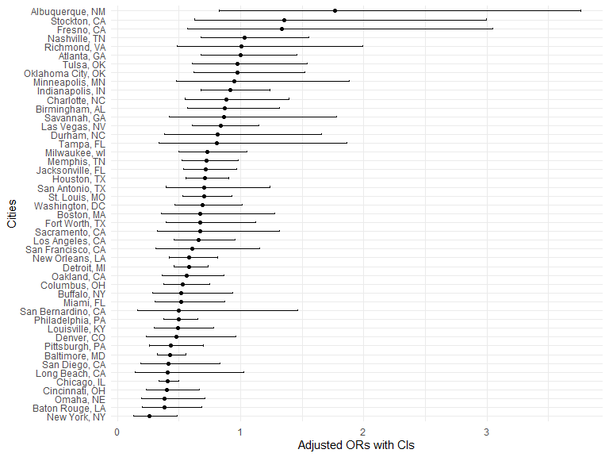
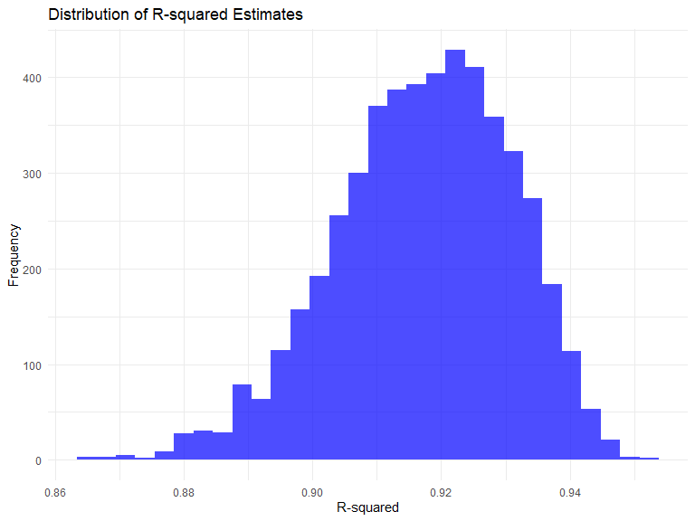
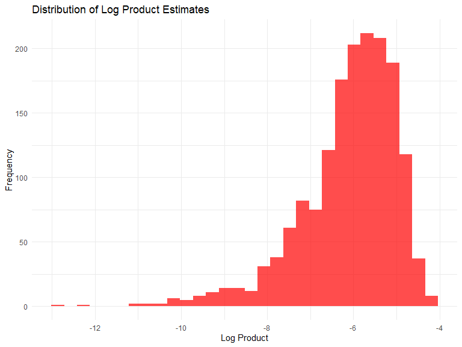
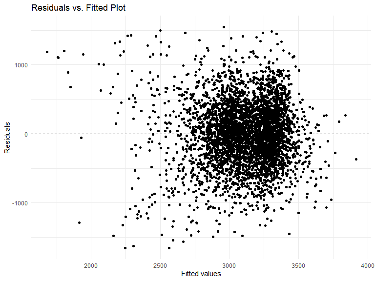
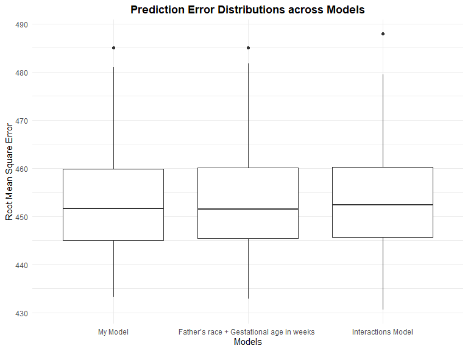

p8105_hw6_cz2750
================
Congrui Zhang
2023-12-02

# Q1

## Data import and wranging

``` r
homicide <- read_csv("homicide-data.csv")

hom_data <- homicide %>%
  mutate(city_state = paste(city, state, sep = ", "),
    is_solved = if_else(disposition == "Closed by arrest", 1, 0),
    victim_age = as.numeric(victim_age)) %>%

  filter(!(city_state %in% c("Dallas, TX", "Phoenix, AZ", "Kansas City, MO", "Tulsa, AL")),
    victim_race %in% c("White", "Black"))
```

## Logistic regression analysis for Baltimore

``` r
# Filter and prepare data for Baltimore, MD
baltimore_data <- filter(hom_data, city_state == "Baltimore, MD")
# Prepare data
baltimore_data <- baltimore_data %>%
  mutate(victim_sex = as.factor(victim_sex),
         victim_race = as.factor(victim_race),
         is_solved = factor(is_solved, levels = c(0, 1)))
# Fit logistic regression model
model_baltimore <- glm(is_solved ~ victim_age + victim_sex + victim_race, 
                       data = baltimore_data, family = "binomial")
# Apply broom::tidy to the model object
tidy <- tidy(model_baltimore)
# Displaying the tidy model summary
print(tidy)
```

    ## # A tibble: 4 × 5
    ##   term             estimate std.error statistic  p.value
    ##   <chr>               <dbl>     <dbl>     <dbl>    <dbl>
    ## 1 (Intercept)       0.310     0.171        1.81 7.04e- 2
    ## 2 victim_age       -0.00673   0.00332     -2.02 4.30e- 2
    ## 3 victim_sexMale   -0.854     0.138       -6.18 6.26e-10
    ## 4 victim_raceWhite  0.842     0.175        4.82 1.45e- 6

``` r
#  Calculate adjusted odds ratios 
adjusted_or <- exp(coef(model_baltimore)["victim_sexMale"])  
CI <- confint.default(model_baltimore) 
CI_adjusted_or <- exp(CI["victim_sexMale", ])
# Displaying the adjusted odds ratio and its confidence interval
list(adjusted_odds_ratio = adjusted_or, confidence_interval = CI_adjusted_or)
```

    ## $adjusted_odds_ratio
    ## victim_sexMale 
    ##      0.4255117 
    ## 
    ## $confidence_interval
    ##     2.5 %    97.5 % 
    ## 0.3245606 0.5578627

### Interpretation

The adjusted odds ratio for ‘victim_sexMale’ is approximately 0.426.
This suggests that the odds of a homicide being solved when the victim
is male are about 42.6% of the odds when the victim is female, given
that all other variables in the model are held constant.

The 95% confidence interval ranges from approximately 0.324 to 0.558.
The fact that this interval does not include 1 is indicative of
statistical significance. It implies that you can be 95% confident that
the true adjusted odds ratio, in the population from which your sample
is drawn, lies within this range.

## GLM analysis for each city

``` r
# Group by city and nest data
nested_data <- hom_data %>%
  group_by(city_state) %>%
  nest()
# Fit logistic regression model and tidy with confidence intervals for each city
nested_data <- nested_data %>%
  mutate(model = map(data, ~glm(is_solved ~ victim_age + victim_sex + victim_race, 
                                data = .x, family = binomial())),
         tidied = map(model, ~tidy(.x, conf.int = TRUE)))
# Extract coefficients for `victim_sexMale`
nested_data <- nested_data %>%
  mutate(ORs = map(tidied, ~filter(.x, term == "victim_sexMale") %>%
                     mutate(OR = exp(estimate),
                            CI_lower = exp(conf.low),
                            CI_upper = exp(conf.high))))
# Unnest and organize results
GLM_results <- nested_data %>%
  select(city_state, ORs) %>%
  unnest(ORs) %>%
  select(city_state, OR, CI_lower, CI_upper)
```

## Creating the Plot

``` r
GLM_results <- GLM_results %>%
  arrange(OR)

GLM_plot <- ggplot(GLM_results, aes(x = reorder(city_state, OR), y = OR)) +
  geom_point() +  
  geom_errorbar(aes(ymin = CI_lower, ymax = CI_upper), width = 0.2) +  
  coord_flip() +
  labs(x = "Cities",
       y = "Adjusted ORs with CIs") +
  theme_minimal()
# Displaying the plot
GLM_plot
```



### Interpretation

1.  Trend of ORs Less Than 1: The majority of cities have odds ratios
    (ORs) less than 1. This could be reflective of a systemic issue or
    pattern across these cities where homicides with male victims have a
    lower likelihood of being resolved compared to those with female
    victims.

2.  Statistical Significance: The fact that many confidence intervals
    (CIs) cross the OR of 1 suggests that, for a number of cities, the
    observed differences might not be statistically significant. This
    could mean that the apparent trend of lower ORs for male victims may
    not hold strong statistical support in every city.

3.  Variability in CIs: The width of the CIs could indicate variability
    in the sample sizes or data quality across different cities. Wide
    CIs might imply that the data from those cities is more variable or
    less certain, while narrow CIs suggest more confidence in the
    precision of the estimate.

# Q2

## Prepare the data

``` r
weather_df = 
  rnoaa::meteo_pull_monitors(
    c("USW00094728"),
    var = c("PRCP", "TMIN", "TMAX"), 
    date_min = "2022-01-01",
    date_max = "2022-12-31") |>
  mutate(
    name = recode(id, USW00094728 = "CentralPark_NY"),
    tmin = tmin / 10,
    tmax = tmax / 10) |>
  select(name, id, everything())
```

    ## using cached file: C:\Users\ASUS\AppData\Local/R/cache/R/rnoaa/noaa_ghcnd/USW00094728.dly

    ## date created (size, mb): 2023-12-02 17:19:26.598974 (8.561)

    ## file min/max dates: 1869-01-01 / 2023-11-30

## Fit the initial regression model

``` r
initial_model <- lm(tmax ~ tmin + prcp, data = weather_df)

# Function to perform a single bootstrap step
bootstrap_step <- function(data) {
  sample_data <- data %>% sample_n(nrow(data), replace = TRUE)
  model <- lm(tmax ~ tmin + prcp, data = sample_data)
  
  # Extracting R-squared
  r_squared <- glance(model)$r.squared
  
  # Extracting coefficients
  coeffs <- tidy(model)
  beta1 <- coeffs$estimate[coeffs$term == "tmin"]
  beta2 <- coeffs$estimate[coeffs$term == "prcp"]
  
  # Conditional check to prevent log of non-positive numbers
  if(beta1 * beta2 <= 0) {
    log_product <- NA  # Assign NA if product is not positive
  } else {
    log_product <- log(beta1 * beta2)
  }
  
  return(data.frame(r_squared = r_squared, log_product = log_product))
}
```

## Perform bootstrap sampling

``` r
set.seed(123)  # For reproducibility
bootstrap_samples <- replicate(5000, bootstrap_step(weather_df), simplify = FALSE) %>% bind_rows()
```

## Plot distributions

``` r
ggplot(bootstrap_samples, aes(x = r_squared)) +
  geom_histogram(bins = 30, fill = "blue", alpha = 0.7) +
  labs(title = "Distribution of R-squared Estimates", x = "R-squared", y = "Frequency")
```



``` r
ggplot(bootstrap_samples, aes(x = log_product)) +
  geom_histogram(bins = 30, fill = "red", alpha = 0.7) +
  labs(title = "Distribution of Log Product Estimates", x = "Log Product", y = "Frequency")
```



## Calculate Confidence Intervals

``` r
r_squared_ci <- quantile(bootstrap_samples$r_squared, c(0.025, 0.975), na.rm = TRUE)
log_product_ci <- quantile(bootstrap_samples$log_product, c(0.025, 0.975), na.rm = TRUE)
```

## Displaying the confidence intervals

``` r
r_squared_ci
```

    ##      2.5%     97.5% 
    ## 0.8882079 0.9402552

``` r
log_product_ci
```

    ##      2.5%     97.5% 
    ## -9.063214 -4.619267

### Interpretation of the Results:

95% Confidence Interval of $\hat{r}^2$ :(0.8882079 to 0.9402552)

95% Confidence Interval of $log(\beta_{1} * \beta_{2})$: (-9.063214 to
-4.619267)

# Q3

## Read data

``` r
data <- read.csv("birthweight.csv")
```

## Data Cleaning

``` r
data <- data %>%
  mutate(
    babysex = factor(babysex, levels = c(1, 2), labels = c("Male", "Female")),
    frace = factor(frace, levels = c(1, 2, 3, 4, 8, 9), labels = c("White", "Black", "Asian", "Puerto Rican", "Other", "Unknown")),
    malform = factor(malform, levels = c(0, 1), labels = c("Absent", "Present")),
    mrace = factor(mrace, levels = c(1, 2, 3, 4, 8), labels = c("White", "Black", "Asian", "Puerto Rican", "Other"))
  )

# Check for missing values
summary(data)
```

    ##    babysex         bhead          blength           bwt           delwt      
    ##  Male  :2230   Min.   :21.00   Min.   :20.00   Min.   : 595   Min.   : 86.0  
    ##  Female:2112   1st Qu.:33.00   1st Qu.:48.00   1st Qu.:2807   1st Qu.:131.0  
    ##                Median :34.00   Median :50.00   Median :3132   Median :143.0  
    ##                Mean   :33.65   Mean   :49.75   Mean   :3114   Mean   :145.6  
    ##                3rd Qu.:35.00   3rd Qu.:51.00   3rd Qu.:3459   3rd Qu.:157.0  
    ##                Max.   :41.00   Max.   :63.00   Max.   :4791   Max.   :334.0  
    ##     fincome               frace         gaweeks         malform    
    ##  Min.   : 0.00   White       :2123   Min.   :17.70   Absent :4327  
    ##  1st Qu.:25.00   Black       :1911   1st Qu.:38.30   Present:  15  
    ##  Median :35.00   Asian       :  46   Median :39.90                 
    ##  Mean   :44.11   Puerto Rican: 248   Mean   :39.43                 
    ##  3rd Qu.:65.00   Other       :  14   3rd Qu.:41.10                 
    ##  Max.   :96.00   Unknown     :   0   Max.   :51.30                 
    ##     menarche        mheight          momage              mrace     
    ##  Min.   : 0.00   Min.   :48.00   Min.   :12.0   White       :2147  
    ##  1st Qu.:12.00   1st Qu.:62.00   1st Qu.:18.0   Black       :1909  
    ##  Median :12.00   Median :63.00   Median :20.0   Asian       :  43  
    ##  Mean   :12.51   Mean   :63.49   Mean   :20.3   Puerto Rican: 243  
    ##  3rd Qu.:13.00   3rd Qu.:65.00   3rd Qu.:22.0   Other       :   0  
    ##  Max.   :19.00   Max.   :77.00   Max.   :44.0                      
    ##      parity            pnumlbw     pnumsga      ppbmi            ppwt      
    ##  Min.   :0.000000   Min.   :0   Min.   :0   Min.   :13.07   Min.   : 70.0  
    ##  1st Qu.:0.000000   1st Qu.:0   1st Qu.:0   1st Qu.:19.53   1st Qu.:110.0  
    ##  Median :0.000000   Median :0   Median :0   Median :21.03   Median :120.0  
    ##  Mean   :0.002303   Mean   :0   Mean   :0   Mean   :21.57   Mean   :123.5  
    ##  3rd Qu.:0.000000   3rd Qu.:0   3rd Qu.:0   3rd Qu.:22.91   3rd Qu.:134.0  
    ##  Max.   :6.000000   Max.   :0   Max.   :0   Max.   :46.10   Max.   :287.0  
    ##      smoken           wtgain      
    ##  Min.   : 0.000   Min.   :-46.00  
    ##  1st Qu.: 0.000   1st Qu.: 15.00  
    ##  Median : 0.000   Median : 22.00  
    ##  Mean   : 4.145   Mean   : 22.08  
    ##  3rd Qu.: 5.000   3rd Qu.: 28.00  
    ##  Max.   :60.000   Max.   : 89.00

There is no missing data. The 20 variables include: babysex, bhead,
blength, bwt, delwt, fincome, frace, gaweeks, malform, menarche,
mheight, momage, mrace, parity, pnumlbw, pnumsga, ppbmi, ppwt, smoken,
wtgain.

## Regression Model Proposal

``` r
model_birthweight <- lm(bwt ~ mrace + frace + momage + gaweeks, data = data)

summary(model_birthweight) %>% 
  tidy() %>%
  select(term, estimate, p.value)
```

    ## # A tibble: 10 × 3
    ##    term              estimate   p.value
    ##    <chr>                <dbl>     <dbl>
    ##  1 (Intercept)         827.   1.25e- 17
    ##  2 mraceBlack         -196.   1.03e-  2
    ##  3 mraceAsian         -132.   2.69e-  1
    ##  4 mracePuerto Rican  -138.   6.42e-  2
    ##  5 fraceBlack          -43.6  5.68e-  1
    ##  6 fraceAsian            5.18 9.64e-  1
    ##  7 fracePuerto Rican   -17.0  8.19e-  1
    ##  8 fraceOther          -35.6  7.72e-  1
    ##  9 momage                2.19 2.51e-  1
    ## 10 gaweeks              59.8  4.30e-148

``` r
summary(model_birthweight) %>% 
  glance()
```

    ## # A tibble: 1 × 8
    ##   r.squared adj.r.squared sigma statistic   p.value    df df.residual  nobs
    ##       <dbl>         <dbl> <dbl>     <dbl>     <dbl> <dbl>       <int> <dbl>
    ## 1     0.222         0.220  452.      137. 3.71e-228     9        4332  4342

Model Fit: The model accounts for about 22.17% of the variance in birth
weight. This suggests that while the included factors do have some
relationship with birth weight, there are still many other unaccounted
factors.

Significant Predictors: The gestational age is a highly significant
predictor, indicating that as gestational age increases, the birth
weight also increases significantly (about 59.80 grams per week).
Additionally, being born to Black mothers is associated with a
significant decrease in birth weight compared to White mothers.

Non-significant Predictors: The mother’s age and the father’s race,
along with other races of the mother, did not show a statistically
significant impact on birth weight in this model.

Model Adequacy: The F-statistic is significant, which indicates that the
model is statistically significant overall. However, the relatively low
R-squared value implies that other factors not included in the model
might influence birth weight.

## Residuals Plot

``` r
data_with_preds <- data %>%
  add_predictions(model_birthweight) %>%
  add_residuals(model_birthweight)

# Plot the residuals against fitted values
ggplot(data_with_preds, aes(x = pred, y = resid)) +
  geom_point() +
  geom_hline(yintercept = 0, linetype = "dashed") +
  labs(title = "Residuals vs. Fitted Plot", x = "Fitted values", y = "Residuals")
```



The “Residuals vs. Fit Plot” for the birth weight model shows that the
residuals are mostly randomly dispersed around the zero point of the
horizontal line, which is consistent with the assumptions of
homoscedasticity and linearity. There was no clear pattern indicating
the presence of nonlinearity or heteroscedasticity.

## Model Comparison

``` r
# Define the models for comparison
set.seed(77)

cv_dataset <-
  data %>% 
  crossv_mc(n = 100,test = 0.2)
  

cv_df <- 
  cv_dataset %>%
   mutate(
    train = map(train, as_tibble),
    test = map(test, as_tibble))

cv_df <-
  cv_df %>%
    mutate(
    my_model  = map(train, ~lm(bwt ~ mrace + frace + momage + gaweeks, data = .x)),
    model_frace_gaweeks = map(train, ~lm(bwt ~ frace + gaweeks, data = .x)),
    model_interactions  = map(train, ~lm(bwt ~ (mrace + momage + gaweeks)^3, data = .x))
    ) %>%
   mutate(
    rmse_my_model = map2_dbl(my_model, test, ~rmse(model = .x, data = .y)),
    rmse_frace_gaweeks = map2_dbl(model_frace_gaweeks, test, ~rmse(model = .x, data = .y)),
    rmse_interactions = map2_dbl(model_interactions, test, ~rmse(model = .x, data = .y))
   )
```

## Reporting

``` r
cv_df %>% 
  select(starts_with("rmse")) %>% 
  pivot_longer(
    everything(),
    names_to = "model", 
    values_to = "rmse",
    names_prefix = "rmse_") %>% 
  mutate(model = fct_inorder(model)) %>% 
  ggplot(aes(x = model, y = rmse)) + 
  geom_boxplot() +
  labs(title = 
  "Prediction Error Distributions across Models", 
       x = "Models", y = "Root Mean Square Error")  +
  scale_x_discrete(
    labels = c("My Model", "Father’s race + Gestational age in weeks ", "Interactions Model")) +
  theme(plot.title = element_text(hjust = 0.5, face = "bold"))
```



What we are comparing here is the cross-validation prediction error of
the models. Overall, my model seems to have the lowest prediction error
(rmse) and therefore is probably the best model .
